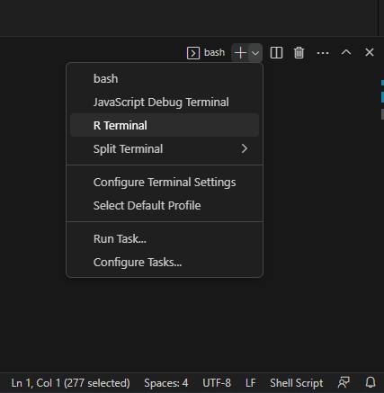

# Visual Studio Code

I've tried to address the specifics of setting up Visual Studio Code
(VSCode) for the specific way I use it at DEOHS, but of course the more
complete documentation of its features are available at the [Visual
Studio Code](https://code.visualstudio.com/docs) website.

## Why not RStudio?

I've come to really like using VSCode for projects that are not
exclusively R based or that are located on the DEOHS cluster. If your
project is in R and you are working on a server on which RStudio Server
is installed, such as mesa3 or plasmid, then that is still the most
convenient option.

If you are using lots of languages or RStudio Server is not installed on
the server you're using, I find Visual Studio code to be a much easier
to set up and easier to use option than things like the Linux remote
desktop
([X2Go](https://github.com/deohs/ehbrain/wiki/Connecting-to-Brain#x2go))
or spinning up Singularity containers to run RStudio and then connecting
through port forwarding. Singularity containers have some additional
advantages when it comes to reproducibility, but for day-to-day work I
prefer lighter-weight solution to making analyses reproducible.

VSCode is nice because:

-   Install it once on *your* machine and it provides an interactive
    environment on *remote* machines.
-   It has integrations for many different languages, including
    interactive support R similar to RStudio.
-   Does a better job keeping your connections alive than PuTTY.
-   Extremely customizable.
-   The shell terminal works much better than RStudio's.

## Setting up SSH Connections

> You should have set up connections to your favorite servers with ssh
> keys. This isn't strictly necessary (VSCode can just prompt you for
> your NETID password), but it does make things easier. If you'd like to
> skip that part, then omit the `IdentityFile` option below.

To start, you can make a set of "bookmarks" that can be used both by
VSCode and your command line `ssh` client by editing or creating a file
called `config` in the directory `$HOME/.ssh/`. You can pull this up in
VSCode with `code $HOME/.ssh/config`.

Here is my config file:

    # Read more about SSH config files: https://linux.die.net/man/5/ssh_config
    Host mesa3
        HostName mesa3.deohs.washington.edu
        User loganap
        IdentityFile C:\users\loganap\.ssh\id_rsa 
        ForwardAgent yes
    Host brain
        HostName brain.deohs.washington.edu
        ProxyJump mesa3.deohs.washington.edu
        User loganap
        IdentityFile  C:\users\loganap\.ssh\id_rsa
        ForwardAgent yes
    Host compute-0-15
        HostName compute-0-15
        ProxyJump brain
        User loganap
        IdentityFile  C:\users\loganap\.ssh\id_rsa
        ForwardAgent yes

I have three "bookmarks". Note that because Brain (the DEOHS Cluster)
and Compute-0-15 (a node on the cluster) are note directly accessible
from outside the DEOHS network, the `ProxyJump` option allows me to
connect to Brain via MESA3 in one step, and also to Compute-0-15 via
Brain via MESA3 in one step. The `IdentityFile` option points to where
my SSH keys are stored *locally* (`$HOME/.ssh/id_rsa` by default).

These bookmarks also allow me to connect on the shell with a single step
(e.g. `$ ssh compute-0-15`).

When you go to the Remote Explorer Tab in VSCode, you should now also be
able to find and connect to any of the servers you've added to the
config file.

The first time you connect to a server, it may take a minute to set up
all the things VSCode needs on the remote end.

The [R add-on](https://code.visualstudio.com/docs/languages/r) is
*highly recommended* as it gives RStudio-like functionality.To search
and install add-ons, go to the gear icon on the lower right and search
for them.

Some additional add-ons I've found useful:

-   vscode-pdf: View PDF files in the editor

-   SAS-Syntax: Syntax highlighting for SAS

-   R Markdown All in One: functionality for R Markdown documents

## Considerations for the Cluster

Things are less straightforward on the cluster, but I have
trial-and-errored my way into a setup that works well for me.

### Interactive R Sessions

R is not immediately available when you log into Brain, and neither are
dependencies required by certain R packages like `sf`. So if you try
starting an interactive session with the R add-on, you'll get an error.
You need to "trick" VSCode into loading these with `module load`
whenever you start a new R session if you want any of the interactive
features to work.

To this end, we'll create some dummy R executables to point VSCode to
that do this work for us.

On Brain, create a file in `~/bin`. You may need to create that
directory. I named my executables after the version of R they call, so,
for example, `R-4.1.0`. Note there's no file extension needed. Note you
can open this up for editing from the VSCode terminal with
`$ code ~/bin/R-4.1.0`.

In this file, add something like:

    #! /usr/bin/env bash

    # Load the 'R' module
    module load 'R/R-4.1.0'

    # Load modules used by SF
    module load UDUNITS/udunits-2.2.26
    module load GDAL/gdal-3.0.2 
    module load GEOS/geos-3.8.0
    module load PROJ/proj-6.2.1

    # Load Postgres module used by RPostgres
    module load PostgreSQL/postgresql-15.2 

    R

Substitute the modules you would like to be loaded (including the proper
version of R) for your own use.

Make this file executable with `$ chmod +x ~/bin/R-4.1.0`.

Now you should be able to start R without loading any modules just by
running `$ R-4.1.0` as if it were a built-in command. If you get
`bash: Rscript-4.1.0: command not found...` or similar, you may need to
[add `~/bin` to your
\$PATH](https://askubuntu.com/questions/402353/how-to-add-home-username-bin-to-path).

Next, we'll tell VSCode to use this executable for R as the default.
Click the gear on the lower left, click "Settings" then search for
"Rpath". Don't use the `~` in your path here. You need to give it the
absolute path to the executable. For me that's
`/home/loganap/bin/R-4.1.0`. Note that if you open a project/folder, you
can also specify a different default for that project (for example, you
may want to use R-3.6.2 in a different project).

Finally, we need to install a couple of packages in R that VSCode uses.
So, on the head node of Brain, open R with your new executable and do:

    install.packages("languageserver")
    install.packages("httpgd")

Now if you open the R extension on the right and start a new R Terminal,
you should be able to view plots you create, examine data.frames with
`View`, and see what objects are in your environment on the environment
pane.

### Compute Nodes & Job Scheduling

If you want to run R interactively on a compute node, you'll have to log
directly into that node, because the R add-on won't know how to start a
`qlogin` session from the head node. See the "Setting up SSH
Connections" section above for an example of how to add a node to your
SSH config (in that case, compute-0-15).

**IMPORTANT**: When you do a direct `ssh` connection to a compute node,
you are bypassing the cluster's scheduler, and can use resources that
are already allocated to someone else. If you are doing this you should
run `qlogin` in another terminal connected to the head node in order to
tell the scheduler what resources you are using. Some helpful options
when running `qlogin` for this purpose are:

-   `-pe smp ###` the number of slots you estimate needing for your work

-   `-l h=compute-0-15` specify a specific node you'd like to reserve

When you have finished your interactive work, return to your other
terminal and quit the `qlogin` session.
